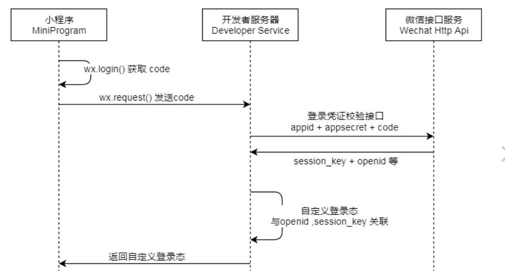

# API 文档

## 1. 扫码点餐

### 1.1. 用户登录

> POST /users/signin

服务器要保存 session_key 和 openid，然后根据 openid 返回 userid。



```JSON
{
  "code": "xxx",
  "wechat_name": "xxx",
  "wechat_avatar": "xxx",
  "location": "xxx"
}
```

```JSON
{
  "userid": 1
}
```

### 1.2. 获取用户信息

> GET /users/:userid/contact

```JSON
{
  "name": "偷外卖死全家",
  "phone": 15521221390,
  "location": "中山大学东校区慎思园 6 号"
}
```

### 1.3. 获取所有菜品列表

> GET /dishes

```JSON
[
  {
    "dish_id": 1,
    "menu": "焗饭",
    "image": "url",
    "name": "蛋炒饭",
    "ordered_count": 999,
    "price": 10.00,
    "star_count": 5
  }
]
```

- dish_id(int)：菜品id
- menu(string)：菜品所在分类
  - 分类具体有：铁板，披萨，焗饭，小吃，饮料。
- image(string)：菜品的图片url吧？没想好
- name(string)：菜品名字
- ordered_count(int)：菜品的存量
- price(float)：菜品的价格
- star_count(int)：菜品的星级
  - 只能是0-5的整数

### 1.4. 获取用户吃过的菜品列表

> GET /dishes?userid=

+ `userid` 用户 id

```JSON
[
  {
    "dish_id": 1,
    "name": "蛋炒饭",
    "user_ordered_count": 2
  }
]
```

+ `user_ordered_count` 用户点该道菜点了几次

### 1.5. 获取每日推荐的图片链接

> GET /images/recommendation?number=

+ `number` 要获取的图片数目

```JSON
[
  "xxx"
]
```

### 1.6. 新建订单

> POST /orders

```JSON
{
  "user_id":15333333,
  "dishes": [
    {
      "dish_id": 1,
      "dish_name": "蛋炒饭",
      "price": 10.00,
      "amount": 2
    }
  ],
  "people_count": 2,
  "dinning_choice": 1,
  "note": "不要辣",
  "takeout_info": {
    "name": "偷外卖死全家",
    "phone": 15521221390,
    "location": "中山大学东校区慎思园 6 号"
  },
  "discount_id": 1
}
```

+ `eating_mode` 用餐方式，`0` 代表堂食，`1` 代表外带，`2` 代表外卖
+ `takeout_info` 外卖信息，如果用餐方式不是外卖，这一项为 `null`

## 2. 协同点餐

1. table 表需要增加一个 orderers_count（整数）以及 user_avatar（字符串）的字段，表示正在该桌子上点餐的人数，用于协同点餐的人数判断。
2. 需要增加一张 table_dish 表来存某张桌子点餐过程中所点的菜品
  + td_id 作为主键
  + table_id
  + dish_id
  + count  表示当前这道菜同时被点了多少次

### 2.1. 获取桌子信息

> GET /tables/:table_id?user_id=

用户扫码进入小程序时，会自动出发此 API，服务端从数据库查询 table 信息，如果发现 user_id 为 null 时，要改为当前用户的 user_id，而且要设 orderers_count 为 1。

```JSON
{
  "table_id": 1,
  "number": "A1",
  "user_id": 1,
  "orderers_count": 0
}
```

### 2.1. 确认参与协同点餐

> POST /tables/:table_id/together?userid=

用户进入菜单页的时候，如果检测到已经有人在点餐，则前端提示是否进入协同点餐模式，用户选择是则触发此 API。对应 table 的 orderers_count 要加 1。

### 2.2. 上传当前已点的菜品

> POST /tables/:table_id/dishes?userid=

此 API 只在协同点餐状态下才会使用（每隔 3s 调用一次）。

```JSON
[
  {
    "dish_id": 1,
    "name": "蛋炒饭",
    "ordered_count": 1 
  }
]
```

返回最新的协同点餐信息：

```JSON
[
  {
    "dish_id": 1,
    "name": "蛋炒饭",
    "ordered_count": 1 
  }
]
```

### 2.3. 协同模式下提交订单

> POST /orders/together?table_id=

比如 A, B 两人同时点餐，A 先点好了就用这个 API 提交，B 是最后一个点好的，就要进入订单确认页面。服务端对于这个 API 的处理只需要将对应 table 的 orderers_count 减 1 即可。

## 3. 显示桌位

### 3.1. 获取当前所有桌位信息

> GET /tables

```JSON
[
  {
    "table_id": 1,
    "number": "A1",
    "user_id": 1,
    "user_avatar": "这里是用户头像链接"
  }
]
```

### 3.2. 预定桌位

> POST /tables/:table_id/reservation?user_id=

如果数据库 table 表对应的记录 user_id 为空，则预定成功（15分钟后取消）。

### 3.2. 取消预定

> DELETE /tables/:table_id/reservation?user_id=

## 4. 其它

### 4.1. 菜品反馈

> POST /dishes/:dish_id/review?user_id=

```JSON
{
  "star": 4.5
}
```

### 4.2. 菜品推荐

参考上面 1.5 的 API 即可。

### 4.3. 抵用券

#### 4.3.1 获取用户当前的抵用券

> GET /discounts?userid=

```JSON
[
  {
    "discount_id": 1,
    "discount": 50  // 意思是抵 50 元
  }
]
```

#### 4.3.2 使用抵用券

参考上面 1.6 的 API，需要增加一个 discount_id 的参数（数据库需要增加一张 user_discount 的表来存用户的抵用券），来表明用哪一张抵用券。1.6 那里的代码逻辑需要判断是否有 discount_id，有则要去数据库取出来减去相应金额并删除之。

### 4.4. 外卖

上面 1.2 有获取用户配送信息的 API。
