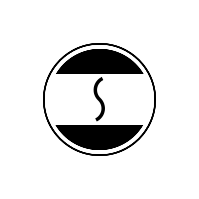

# SYSU Canteen 0

> 中大零饭扫码点餐系统

+ [GitHub Pages](https://dtosaad.github.io)
+ [Tower 团队管理](https://tower.im/projects/8d7d7a72725242b3beb1609174e058ba/)
+ [Modao 原型工具](https://modao.cc/app/YiH5dTdxFF3JzQAkRsSjOWMHPRmoodZ)

---

1. [About（项目规划）](https://github.com/dtosaad/documents/blob/master/about.md)

2. [Team Profile（团队组建）](https://github.com/dtosaad/documents/blob/master/team_profile.md)

3. [Product Investigations（项目前期调研）](https://github.com/dtosaad/documents/blob/master/product_investigations.md)

4. [Vision（项目愿景）](https://github.com/dtosaad/documents/blob/master/about.md#vision)

5. [Product Backlogs（产品特性）](https://github.com/dtosaad/documents/blob/master/about.md#backlogs)

6. [Requirement Specification（需求规格说明)](https://github.com/dtosaad/documents/blob/master/product_requirements.md)
  + 6.1. [Usecase Diagram（用例图）](https://github.com/dtosaad/documents/blob/master/assets/use_cases.png)
  + 6.2. [Use Cases（用例+活动图）](https://github.com/dtosaad/documents/blob/master/assets/use_cases.png)
  + 6.3. [Domian Model（领域模型）](https://github.com/dtosaad/documents/blob/master/assets/domain_model.png)
  + 6.4. [State Model（状态模型）](https://github.com/dtosaad/documents/blob/master/assets/state_model.png)
  + 6.5. [System Sequence Diagram（功能模型）](https://github.com/dtosaad/documents/blob/master/system_sequence_diagram.md)

7. Design（设计）
  + 7.1. [UI Design](https://github.com/dtosaad/documents/tree/master/assets/ui)
  + 7.2. Database Design
    + 7.2.1. [用户及权限系统数据库设计](https://github.com/dtosaad/documents/blob/master/assets/database_design.png)
    + 7.2.2. [子系统数据库设计](https://github.com/dtosaad/documents/blob/master/assets/database_design.png)
    + 7.2.3. [第三方数据评审结果](https://github.com/dtosaad/documents/issues)
  + 7.3. [API 设计](https://github.com/dtosaad/documents/blob/master/API.md)

8. 生产规范与指南
  + 8.1. [代码规范：Airbnb JavaScript Style Guide](https://github.com/airbnb/javascript)
  + 8.2. [REST API 设计规范](https://en.wikipedia.org/wiki/Representational_state_transfer)

9. [Meeting Recordings（会议记录）](https://github.com/dtosaad/documents/blob/master/meeting_recordings.md)
  + [Meeting 0 - Inception](https://github.com/dtosaad/documents/blob/master/meeting_recordings.md#metting-0---inception)
  + [Meeting 1 - Iteration 1](https://github.com/dtosaad/documents/blob/master/meeting_recordings.md#metting-1---iteration-1)
  + [Meeting 2 - Iteration 2](https://github.com/dtosaad/documents/blob/master/meeting_recordings.md#metting-2---iteration-2)
  + [Meeting 3 - Iteration 3](https://github.com/dtosaad/documents/blob/master/meeting_recordings.md#metting-3---iteration-3)
  + [Meeting 4 - Iteration 4](https://github.com/dtosaad/documents/blob/master/meeting_recordings.md#metting-4---iteration-4)
  + [Meeting 5 - Iteration 5](https://github.com/dtosaad/documents/blob/master/meeting_recordings.md#metting-5---iteration-5)

10. [Tech Report（技术报告）](https://github.com/dtosaad/documents/blob/master/tech_report.md)

11. 建模练习
  + [美团外卖用例文档](https://github.com/dtosaad/documents/blob/master/modeling_exercises/meituanwaimai.md)
  + [额外的个人练习（作业没作要求）](https://github.com/dtosaad/documents/blob/master/modeling_exercises/addition.md)
