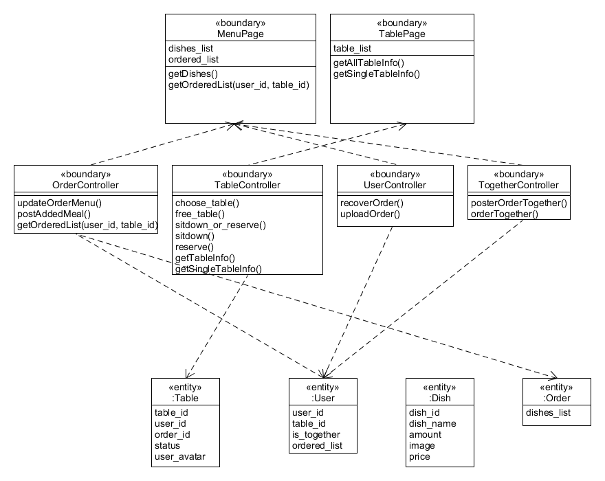
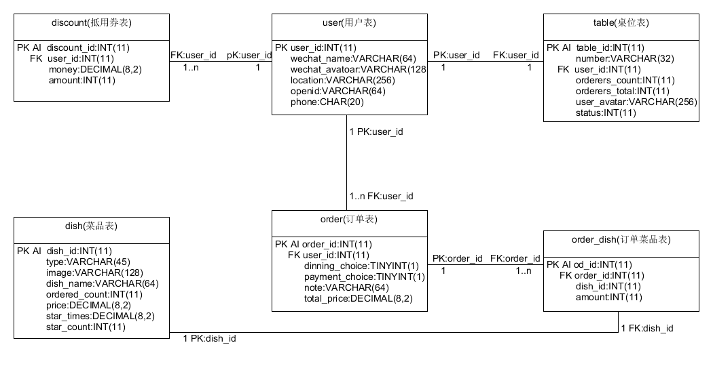
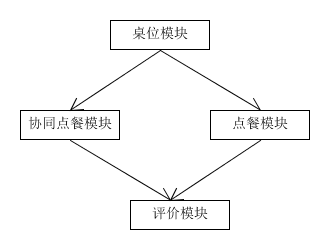

# 软件设计文档

[TOC]

## 引言

### 设计背景

- 本项目的愿景是打造一个可供**必胜客、味千拉面等中端餐厅**使用，减少人力成本的一个扫码点餐系统。适用餐厅应具备**堂食（主要服务**）、**可叫服务员**的要素。
- 本项目所包含的功能包括用户来到餐厅之后，扫描桌子上的二维码就可以进入小程序进行点餐。小程序能给打算到该餐厅的用户提供当前**桌位**使用情况的信息，方便用户错开用餐高峰期、预订座位、快速地找到空闲的桌位或者同伴的桌位。并且多个用户可以进行**协同点餐**，只要扫取桌上的二维码，用户就可以实时看到其他人的点餐信息（菜品及其数目），方便用户在聚餐时候的多人点餐。

### 编写目的

- 在本项目的需求分析阶段，将用户和商家对于本项目的需求做了详细的分析，这些需求的获取通道是参考了现有的点餐软件以及本项目团队成员的亲身经历。在需求分析的基础上，对软件系统做概要设计。主要解决了实现该软件需求的程序模块设计问题，包括如何把该系统划分成若干个模块、决定各个模块之间的接口、模块之间传递的信息，以及数据结构、模块结构的设计等。在下文的设计报告中将对设计进行详细的说明。
- 在详细设计中，开发者可以参考设计报告，在设计报告对改软件所做的模块结构的设计的基础上，对软件进行详细描述。在软件进行测试的时候甚至后续的维护阶段也可以参考此说明书，以便于了解设计过程中所完成的各模块的设计结构，或在修改的时候找出本阶段设计的不足或错误。

### 软件概述

- 本项目采用的前后端分离的开发模式，前端考虑到服务类软件用完即走且轻量级的性质，使用了微信小程序作为客户端，而后端则是采用的`Node.js`服务程序。

- 软件的设计框架如下：

  

## 项目计划

### 参与人员

| 学号     | 姓名   | 学院                   | GitHub用户名 | 分工                                                 | 备注         |
| -------- | ------ | ---------------------- | ------------ | ---------------------------------------------------- | ------------ |
| 15331424 | 郑钊   | 数据科学与及计算机学院 | painterdrown | 项目管理、后端测试、需求分析、API设计                | 小组以外成员 |
| 15331414 | 张子扬 | 数据科学与及计算机学院 | SYSUZZY      | 前端开发、前端项目管理、需求分析、文档编写、前端测试 |              |
| 15331426 | 钟敏欣 | 数据科学与及计算机学院 | MinxinZhong  | 需求分析、文档编写、UI设计                           |              |
| 15331413 | 张志坚 | 数据科学与及计算机学院 | 123zzj123    | 前端开发                                             |              |
| 15331427 | 钟荣柳 | 数据科学与及计算机学院 | zhongrliu    | 后端开发、文档编写、后端测试                         |              |
| 15331430 | 仲攀   | 数据科学与及计算机学院 | zp1679827225 | 后端开发、后端测试                                   |              |

### 开发时间

| 起始时间   | 结束时间   | 实现相关事项                   |
| ---------- | ---------- | ------------------------------ |
| 2018-04-01 | 2018-04-07 | 需求调研，开发分工             |
| 2018-04-08 | 2018-04-14 | 需求分析文档，设计文档初步确立 |
| 2018-04-15 | 2018-04-21 | 前端、后端整体框架搭建         |
| 2018-04-22 | 2018-04-28 | 数据库设计、API文档的编写      |
| 2018-04-29 | 2018-05-20 | 第一轮迭代开发                 |
| 2018-05-21 | 2018-06-20 | 第二轮迭代开发                 |
| 2018-06-21 | 2018-07-07 | 测试                           |

### 开发环境及工具

| 对象   | 环境       | 工具                       |
| ------ | ---------- | -------------------------- |
| 前端   | 微信小程序 | 微信小程序开发工具、VsCode |
| 后端   | 腾讯云     | sublime Text3、VsCode      |
| 数据库 | MySQL      | phpmyadmin                 |

## 开发设计

### 需求概述

#### 功能需求

经过调研竞品以及团队内的讨论，最终的功能需求定为如下的需求：

- 能够查看餐厅内的桌位使用情况，并且能够预订或者选座；
- 能够点餐，并选择外带、外卖、堂食的用餐方式；
- 能够在桌位界面选择桌子进行协同点餐，与伙伴共同分享菜单。

#### 性能需求

- 时间特性需求：
  - 软件启动时间：小于1s
  - 系统实时响应时间：软件使用过程中，用户用手指点击各个功能模块时的响应时间需要在用户能够容忍的时间范围之内，要求小于1s
  - 数据更新时间：软件使用过程中，例如桌位和协同点餐的菜单的同步刷新时间设置为1s
- 精度需求
  - 要按照严格的数据格式输入，对符合数据格式要求的输入进行提示。 

#### 数据需求

- 数据采集的要求
  - 输入源：手机触控以及虚拟键盘
- 数据输出需求
  - 输出设备：手机屏幕

### 软件架构设计

- 用例模型：本项目的用例模型如下图所示，在模块的划分上也是依据此用例模型进行划分的。

  

- 点餐状态模型

  

### 技术选型

#### 前端

​	前端在软件结构的设计上采用的是MVC的结构，MVC架构是一种软件设计典范，用一种业务逻辑、数据、界面显示分离的方法组织代码，将业务逻辑聚集到一个部件里面，在改进和个性化定制界面及用户交互的同时，不需要重新编写业务逻辑。 因为MVC的优点，又考虑到本身的项目规模比较小，所以采用了MVC的前端框架。

MVC模式示意图

本系统使用MVC的示意图：点餐界面

​	关于前端的平台选用的是微信小程序，由于本项目是一款服务类的软件，十分符合微信小程序“用完即走”的性质，并且项目规模较小，很适合微信小程序的开发，所以选择了该平台。微信小程序的接口很好的支持了我们的软件，能够使用微信的数据能够很大程度上减轻了我们对与用户的管理负担。

**设计模式**

​	设计模式上，前端运用了**模板方法模式**，将常用的UI组件模板化，以方便后面的复用。前端在`components/numberController`使用了模板方法，自定义UI组件，以方便后面的使用。

#### 后端

​	由于扫码点餐的用户规模不大，并且小程序具有“用完即走”的性质，所以本系统后台开发优先考虑轻量级、易上手的框架，自然想到了Express、koa这两个常用框架，最终选择Koa是基于以下理由：

- koa移除了Express内置的router、view等功能，使得框架本身更轻量级
- 异步流程控制：Koa 2 采用async/await，所以可以用编写同步代码的方式编写异步代码，相比于Express采用的callback异步处理，明显简介不少
- 错误处理：Express使用callback捕获异常，对于深层次的异常捕获不了，而Koa使用try catch，能更好地解决异常捕获

软件设计技术：

- Structure Programming(结构化编程)：
  - 相同路由前缀的请求对应同一个模块，具体路由用模块中不同导出函数响应
    - (back-end/routes/index.js line 42~43)路由前缀为/dishes的请求对应Dish模块，如果后续还有路由/all，则表示请求所有菜品信息，用Dish模块的all函数响应，如果后续没有路由，则表示请求某个用户吃过的菜品，用户信息在路由query部分传递，这时用Dish模块的mine函数响应
    - (back-end/routes/index.js line 50~56)路由前缀为/orders的请求对应Order模块，不同的具体路由用Order模块的不同函数响应
    - 路由前缀为/tables的请求对应Table模块，不同的具体路由用Table模块的不同函数响应
  - 使用try-catch结构：
    - cancelRes模块8~20行
    - getDiscount模块4~19行
    - getUserId模块19~69行
    - getUserInfo模块2~14行
    - Order模块13~1340行
    - query模块30~43行
    - queryOrders模块5~34行
    - review模块6~22行
  - if-else控制结构：
    - cancelRes模块11~17行
    - getDiscount模块6~8行
    - getUserId模块11~15行、46~60行、
    - Order模块38~52行、55~77行、99~109行、110~129行、151~158行
    - query模块20~24行、32~38行
    - queryOrders模块6~8行
    - review模块9~19行
    - TogetherOrder模块30~36行
  - for循环结构
    - insertItems模块6~17行
    - Order模块23~35行、85~95行、148~160行、
    - queryOrders模块20~28行
    - TogetherOrder模块7~13行、10~12行、46~48行
- Service Oriented Architecture(面向服务的体系结构)：手机端或者PC端微信开发者工具上的模拟器，可以通过网络请求部署在云端的后台服务程序的服务，比如获取用户id(controllers/getUserId模块)，获取用户吃过的菜品列表(controllers/dishes模块)

### 数据库设计

### 模块设计

#### 后端

​	在扫码点餐的用例中，用户需要获取菜品列表、自己当前已经点的菜品、自己以前吃过的菜品等信息，所以后端的的职责主要是处理前端发来的请求和数据，不同路由对应不同处理逻辑，并且可能需要与数据库交互，因此将后端划分为处理路由请求的模块和与数据库交互的模块，前端发来的请求和数据经过路由处理模块，转化成具体的数据库指令，再发送给数据库交互模块，由后者实现具体数据库存取操作。具体来说，数据库交互部分包括controllers目录下的query模块，路由处理部分包括controllers目录下除了query之外的其他模块。

#### 前端

**模块列表**

| 模块名称     | 功能                             |
| ------------ | -------------------------------- |
| 桌位模块     | 查看桌位，预订桌位，参与协同点餐 |
| 点餐模块     | 堂食、外带、外卖的点餐模式       |
| 协同点餐模块 | 多用户共同点餐                   |
| 评价模块     | 用餐后为菜品评价                 |

**模块关系图**

**模块设计**

桌位模块

- 功能
  - 查看桌位，预订桌位，参与协同点餐
- 接口与属性
  - method
    - choose_table()
    - free_table()
    - sitdown_or_reserve()
    - sitdown()
    - reserve()
    - getTableInfo()
    - getSingleTableInfo()
  - properties
    - table_id
    - user_id
    - order_id
    - status
    - user_avatar

点餐模块

- 功能
  - 堂食、外带、外卖的点餐模式；
  - 能够选择菜品进行点餐
- 接口与属性
  - method
    - updateOrderMenu()
    - postAddedMeal()
    - getOrderedList(user_id, table_id)
  - properties
    - dishes_list
    - dish_id
    - dish_name
    - amount
    - image
    - price
    - ordered_list

协同点餐模块

- 功能
  - 多用户共同点餐；
  - 能够实时分享菜单
- 接口与属性
  - method
    - updateOrderMenu()
    - postAddedMeal()
    - getOrderedList(user_id, table_id)
    - posterOrderTogether()
    - orderTogether()
  - properties
    - dishes_list
    - dish_id
    - dish_name
    - amount
    - image
    - price
    - ordered_list
    - is_together

评价模块

- 功能
  - 用餐后为菜品评价
- 接口与属性
  - method
    - review()
  - properties
    - ordered_list
    - user_id
    - order_id

### 接口设计

