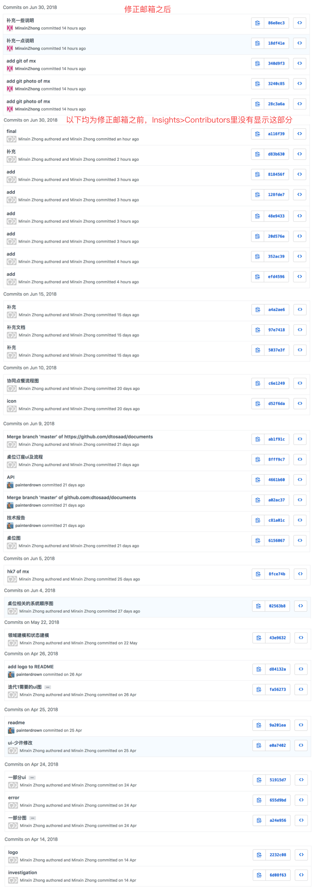

## 个人总结

在本次合作过程中，我主要是一个PM和设计担当，在“分析”和“设计”上做得比较多。

把自己从前关于产品、设计等的想法以及方法论落地成具体项目的过程是非常有意思的，你需要去进行竞品调研、用户分析，你需要去站在用户视角、产品视角、商业视角来思考，你需要去分析各种业务流程再而产出各种建模图、原型图，想清楚**流程以及领域建模**真的非常重要，我在这个过程中得到不少锻炼。

但是不足之处还有很多，还是需要继续学习。改变世界前不如改变自己。

此外，特别感谢我的靠谱队友**ZZY@SYSUZZY**，**ZZ@painterdrown**，**ZRL@zhongrliu**。特别是@SYSUZZY，当设计图上有些参数忘记标的时候，他还是能把界面完成得很好，而且本次合作可以说**80%**的前端工作也是他完成的，也因此他与作为设计师的我交流得比较多，在设计实现的过程中他也教会了我不少有关前端的知识。

## PSP2.1统计表

| PSP阶段                    | 耗时(h) |
| :------------------------- | :------ |
| 计划                       | 2       |
| · 估计任务时间             | 2       |
| 开发                       | 88      |
| · 分析需求                 | 24      |
| · 生成设计文档             | 10      |
| · 设计复审                 | 5       |
| · 代码规范                 | 0       |
| · 具体设计                 | 45      |
| · 具体编码                 | 0       |
| · 代码复审                 | 0       |
| · 测试                     | 4       |
| 报告                       | 0.5     |
| ·测试报告                  | 0       |
| ·计算工作量                | 0.5     |
| 事后总结，提出过程改进计划 | 4       |
| **合计**                   | 94.5    |

## Git统计报告

很抱歉现在才发现：由于我在GithubDesktop上的邮箱有误，因此项目上生成的我个人的贡献可视化图表只包含了我**修正邮箱后**的最后几条commit：

**因此我截了之前的commit记录，如下（图稍微有点大，这里加载的比较慢；或者也可以在这里查看documents/final_reports/Minxin/zmx_git.png；或者直接在这个项目的commit记录里查看也完全ok）：**

## 劳苦工作

收获了画各种建模图、业务流程图、原型图的思维和能力。