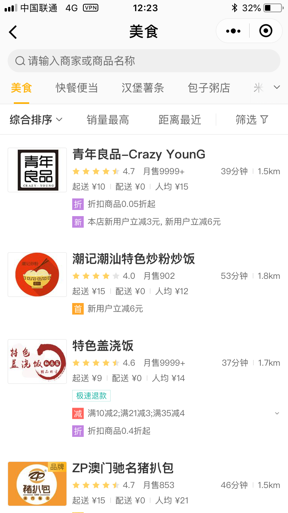
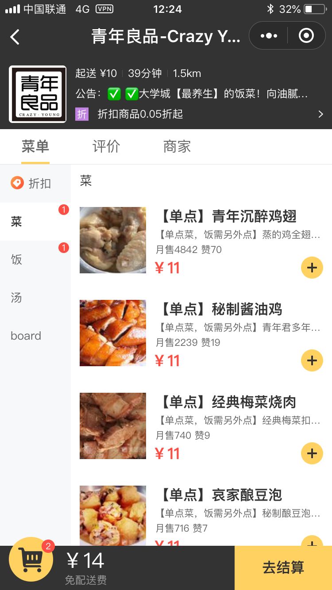
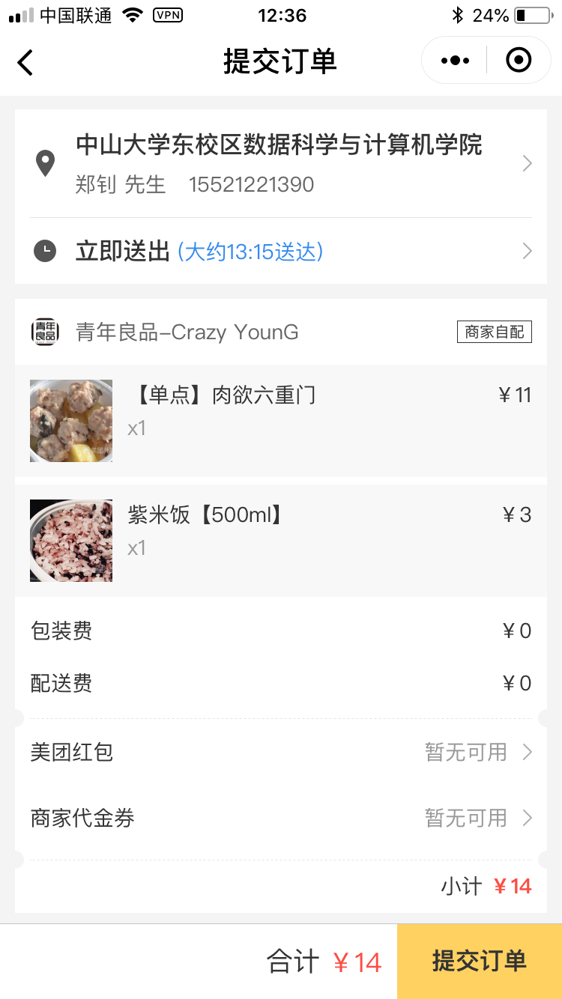

# 美团外卖 App 用例文档

## 用例文档

美团外卖是整合各个提供外卖服务的店家的外卖 信息的 APP，使用者可以在 APP 上面看到提供外卖服务的店家的各种信息，包括店家的电话、 地址、提供的外卖服务。

+ 美团外卖品类包括附近美食、水果、蔬菜、超市、鲜花、蛋糕等，无论是早午晚餐、下午茶、宵夜，还是中餐、西餐、家常菜、小吃、快餐、海鲜、火锅、川菜、蛋糕、烤肉、水果、饮料、甜点等；
+ 多品牌入驻如必胜客、肯德基、KFC、麦当劳、汉堡王、星巴克、COCO都可奶茶、U鼎冒菜、真功夫、每日优鲜、美食天下等； [1] 
+ 美团外卖还提供送药上门、美团专送、跑腿代购等多种服务；
+ 电脑、手机APP、微信均可下单，支持美团支付、微信支付、支付宝、Apple pay等多种支付方式。

这是美团外卖的主界面，左上方点击能使用 gps 定位到所在位置，右上方是显 示所在位置的的天气、温度，这些是外部功能。左上方点击也能自己输入现在的位置，不管 如何必须使 APP 得到一个位置，只有外卖服务覆盖了这个位置的店家才能在搜索中和下面 的推荐中出现。在位置的下方有一个搜索栏，通过关键字可以搜到想要的店家或者外卖服务。

这是附近店家，这里可以根据不同的要求进行排序，并且这里显示了店家销量、距离、人均购买额、最低起送价等影响使用者选择的信息。最下方有三个按钮，第一个首页跳转到现在这个主界面，第二个订单跳转到订单页面，显示 过去已完成和现在还未完成的订单，第三个我的则是跳转到个人信息设置页面，在这个页面 可以进行外卖送到的地址、电话等的设置。

上面是商家的详情页：

1. 左上方的返回按钮，返回主界面;搜索按钮，搜索该店家提供的外卖服务;收藏按 钮，收藏该店家;拼单按钮，与他人拼单;
2. 上方的店家的公告，优惠信息和点餐须知等等
3. 右上方的点菜、评价、商家按钮，点进去分别显示提供的外卖服务列表、使用过该 店家外卖服务的人评价和详细的商家信息
4. 左边一列是店家对自己外卖服务的分类，点击分类上的按钮会跳转到该分类下的外
卖商品
5. 右边那列外卖商品的信息，名称、月销量、赞数、价格，加号表示将 1 件该商品加
入购物车
6. 最下面有当前购物车商品的总价格，价格左边是购物车，点开显示准备支付的商品
信息，价格右边是去结算按钮，进入提交订单页面

上面是确认订单的页面：

1. 左上方的返回按钮返回到店家页面
2. 提交订单表示这个页面是提示订单页面
3. 上方的地址信息和手机信息，右边的箭头转到修改信息页面
4. 立刻送出和预计送达的时间，右边的箭头跳转到送出时间
5. 中间的订单的信息
6. 右下角的提交订单按钮跳转到支付页面

## 建模要求

1. 建模答案需包括：

+ 用例图
+ 新建清单及任务的活动图
+ 清单/任务管理领域模型
+ 清单/任务的状态图
+ 任意一个场景的系统顺序图
+ 操作协议

2. 具体的制图要求同课程规范
