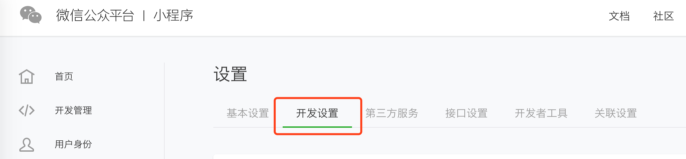
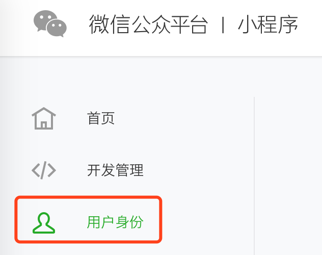
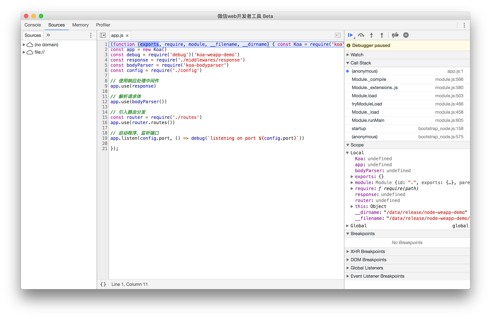
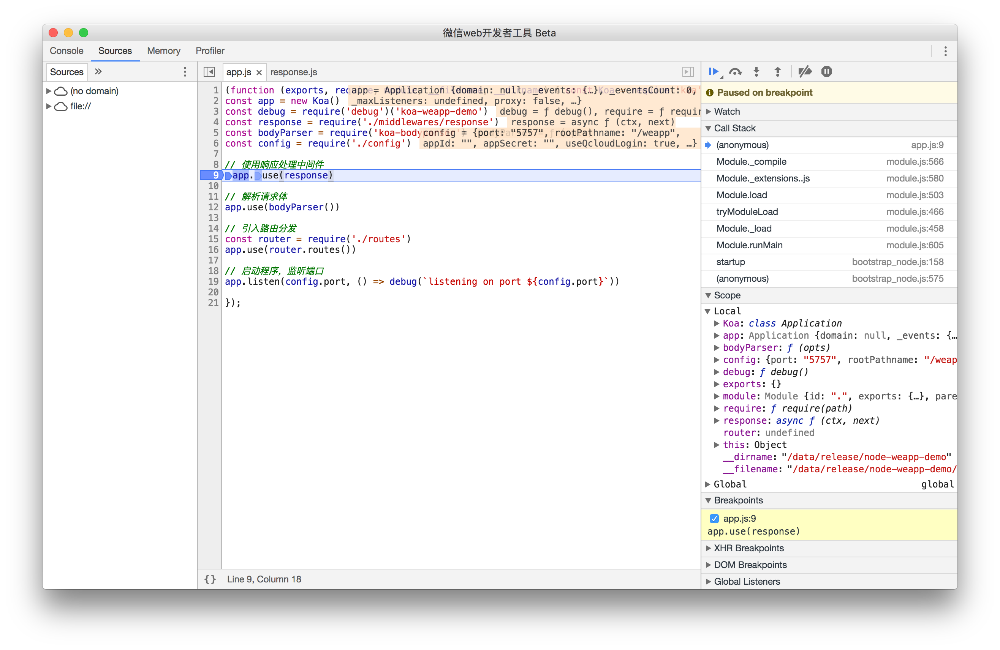

# 微信小程序环境搭建技术报告

中大零饭是一个微信小程序，开发微信小程序要做比较多的准备工作：

1. 注册微信小程序
2. 部署开发环境
3. 部署生产环境

## 注册微信小程序

1. 上官网：https://mp.weixin.qq.com/cgi-bin/wx

然后经过账号信息、邮箱激活、信息登记就可以注册成功。注册成功后，要进行实名登记和微信绑定（已经实名登记过的可以忽略这一步）。

2. 小程序信息

登录小程序后，根据下图的位置可以查看小程序信息，包括：

+ AppID
+ AppSecret
+ 服务器域名
  + request合法域名
  + socket合法域名
  + uploadFile合法域名
  + downloadFile合法域名

常用的是 AppID 和 request合法域名。

接下来在用户身份那里添加开发者，把小伙伴们都拉进群（非开发者也可以添加进来，这样才能开发时候进行体验）。

## 部署开发环境

将小程序的代码压缩包下载，解压后：

+ client
+ server
+ project.config.json

然后使用微信开发工具打开该项目。

项目目录可以选择 wafer2-startup 提供的 Demo 代码，也可以自行开发。

创建好项目之后会打开微信开发者工具页面，点击右上角腾讯云，选择“上传测试代码”，即可将本地的服务端代码部署到腾讯云免费分配的开发环境中。

> 注意： 
> 服务器端的代码上传逻辑为合并，即如果有重名的文件，后面上传的代码会覆盖前一次上传的，如果不重名，则两者保留。文件夹一律为合并，即文件夹内文件保持前面所说的合并逻辑，不会完全替换整个文件夹。另外目前暂不支持删除线上文件、文件夹功能，您可以使用恢复开发环境来清空代码目录重新上传。

腾讯云微信小程序解决方案 2.0 是基于 Node.js 开发的，提供远程调试功能，在微信开发者工具页面点击右上角“腾讯云”，在下拉菜单中选中“启动单步调试”，系统会自动重启远程服务，并使用 inspect-brk 模式启动 Node.js App，接着开发者工具会打开调试窗口。

此时，App 进入暂停状态，这个时候您可以在 app.js 或者其他启动程序就会载入的包中下断点，点击代码左边的行号即可下断点，接着点击右上角蓝色的三角形按钮，启动 App，可以看到，程序会在断点处暂停下来。

## 部署生产环境

腾讯云提供了与开发环境完全隔离（运行环境和数据库）的生产环境，生产环境分配的数据库为云数据库。

1. 进入腾讯云微信小程序开发者工具解决方案控制台，并点击【生产环境】即可看到开通界面。
2. 设置域名信息。要开通生产环境，您必须拥有一个域名。在开通界面里，您可以注册一个新的域名，也可以直接选择已有域名。
3. 完成域名信息设置后，点击【下一步】即可进入初始化界面。
4. 等待初始化完成再次点击【下一步】即可进入控制台。

最后总结下两个环境的区别：

**开发环境**

+ 免费使用
+ 自动分配测试用二级域名：xxxxxxx.qcloud.la
+ 自动部署免费 HTTPS
+ 仅可用于线上调试，不可发布
+ 代码部署、运行和数据库与生产环境完全分开
+ 与微信开发工具打通，可一键部署、调试、重启和恢复代码

**生产环境**

+ 付费使用
+ 用户需购买或使用已有的腾讯云域名
+ 自动部署免费 HTTPS
+ 用于线上发布，不可调试
+ 使用微信开发工具上传代码，在腾讯云控制台操作部署，上传和发布分离，降低误操作风险
